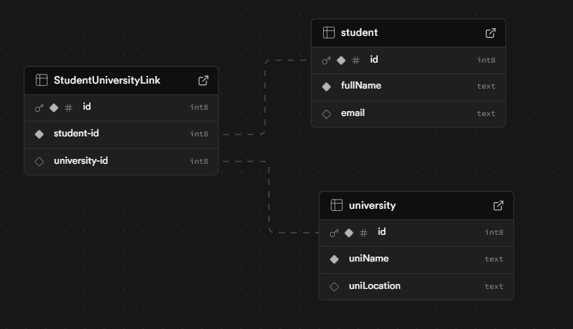

# Part 1

## Explanation

This is a simple tool to manage students and universities, allowing you to link them together.

## Technologies Used

1. **HTML/CSS**: For the user interface and styling.
2. **JavaScript**: For interactivity and dynamic behavior.
3. **PHP**: For backend functionality and server-side logic.

## Database

## AI Usage

I leveraged my prior experience in PHP and used GitHub Copilot to enhance my knowledge and review my code. By comparing its suggestions with my implementation, I was able to improve various aspects of the project.

Additionally, I used ChatGPT to outline a basic structure for the project, which helped streamline the development process.
